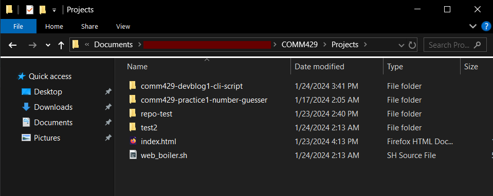
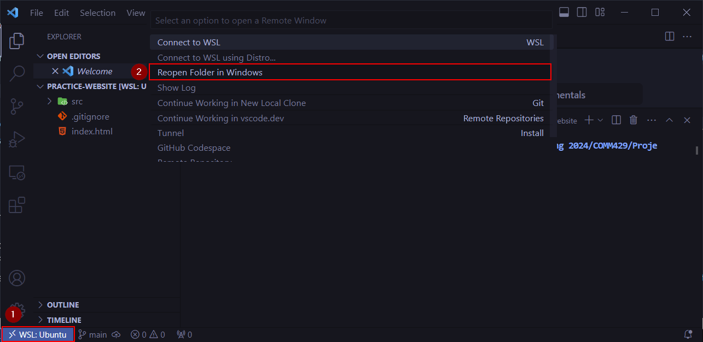
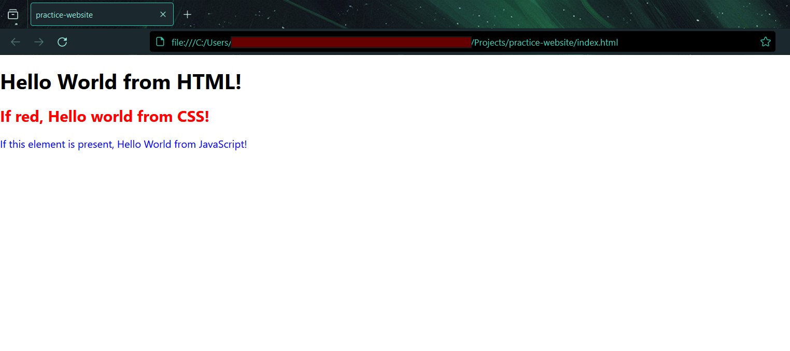
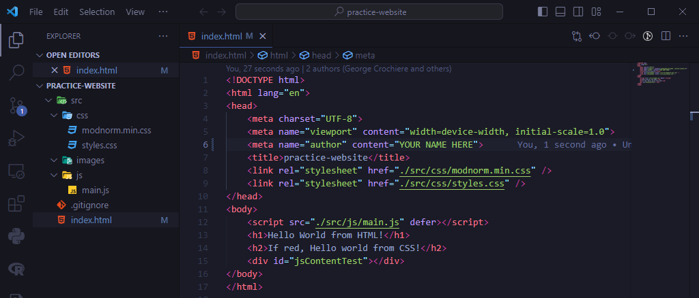

# Web Development Starter Script
George D. Crochiere

COMM-429 Front End Development

## Table of Contents
- [What is this script?](#intro)
- [Prerequisites](#prereq)
- [Installation](#install)
- [Running the Script](#run)
    - [Windows](#run-win)
    - [Linux](#run-linux)
- [Results](#results)

___

<a name="intro"></a>

## What is this script?
Web development often requires the same file structure as a starting point, regardless of the final result. The file structure is able to change overtime, but once a user developes a standard file structure of their choosing, all projects start the same. This project develops the following file stucture for starting a web development project:

```
    projectName
    │   .gitignore
    │   index.html
    └───src
        ├───css
        │       modnorm.min.css
        │       styles.css
        │
        ├───images
        └───js
                main.js
```

An additional ```.git``` folder can be created if the proper remote repository parameter is included in the command.

After the project is created, the project itself will open up in Visual Studio Code and open up the resulting ```index.html``` file in the default browser.

___

<a name="prereq"></a>

## Prerequisites
This program assumes that you are using either a Windows or Linux operating system. You will need the following programs installed per system to allow the script to function:

- Windows
    - Windows Subsystem for Linux (WSL)
    - Visual Studio Code
    - A Web Browser (Firefox, Chrome, etc.)
    - A folder where you want all of your web projects to be located
- Linux
    - Visual Studio Code
    - A folder where you want all of your web projects to be located

If you wish to utilize the git functionality of creating a project connected to a remote repository, ensure that you have git installed and configured. [The installation guide can be found here.](https://github.com/git-guides/install-git)

To configure git, run the following commands using your name and respective email:
```shell
    git config --global user.name "YOUR NAME"
    git config --global user.email "YOUR EMAIL"
```

> **NOTE:** For Visual Studio Code (VSCode), ensure that the path variable "code" is properly added, especially for Windows. Refer to [the VSCode Installation Documentation](https://code.visualstudio.com/docs/setup/setup-overview) for your operating system to ensure VSCode is fully installed.

___

<a name="install"></a>

## Installation
Follow the proceeding steps to install the script. These steps work for both the Windows and Linux operating systems.

1. <a href="https://github.com/GeorgeCrochiere/comm429-devblog1-cli-script/blob/main/web_boiler.sh">Download</a> the shell file ```web_boilder.sh``` and locate it on your system.
2. Place the shell script in the projects folder as specified in the **Prerequisites** section

An example is shown below, where all projects are placed in the directory ```Projects```. A couple example projects are in this directory.



<p class="imgQuote">An example directory showing the "Projects" folder with the "web_boiler.sh" script and various projects inside the directory.</p>
___

<a name="run"></a>

## Running the Script
As this script can be ran on both Windows and Linux, the following steps will specify how to run the program on both operating systems.
Whenever a project is created, given the respective project name, it creates the structure that is show at the top of the document. The remote git repository option will create the additional ```.git``` directory and options

<a name="run-win"></a>

### Windows
To run the program on Windows:

1. Open either the Command Window or Powershell, and navigate to the projects directory.
2. Enter the command of your choosing:
    - To get help on the function, use the command:

        ```shell
        bash web_boiler.sh -h
        ```

        This funciton will display general information on how to utilize the function. This document serves as additional documentation to this function.

    - To create a new project with a no-space name ```projectName```, without creating a remote GitHub repository, run the following command:
        
        ```shell
        bash web_boiler.sh projectName
        ```

        Example:
        
        ```shell
        bash web_boiler.sh practice-website
        ``` 

    - Additionally, to create a new project with a name ```projectName``` linking to a valid remote repository ```remoteGitRepo```, the following command can be used:
        
        ```shell
        bash web_boiler.sh projectName remoteGitRepo
        ```

        You can then push the repository to GitHub with the following command. This command must be done seperately due to proxy issues. This command must be executed in the terminal, whilst in your new project's directory, which can be done in VSCode's terminal once the new project loads.

        ```shell
        git push -u origin main
        ```

        Example:

        ```shell
        bash web_boiler.sh practice-website https://github.com/GeorgeCrochiere/test-repo.git
        ```

3. Upon creating a project, when VSCode opens, it will open in the WSL environment. You can either edit the project in the WSL environment, or click on the blue button in the bottom-right to open the project in your local installation of VSCode.

    

    <p class="imgQuote">How to redirect from WSL's VSCode to the local, Windows VSCode.</p>

<a name="run-linux"></a>

### Linux
To run the program on Linux:

1. Open the terminal, and navigate to the projects directory
2. Enter the command of your choosing
    - To get help on the function, use the command:

        ```shell
        shell web_boiler.sh -h
        ```

        This funciton will display general information on how to utilize the function. This document serves as additional documentation to this function.

    - To create a new project with a no-space name ```projectName```, without creating a remote GitHub repository, run the following command:

        ```shell
        shell web_boiler.sh projectName
        ```

        Example:

        ```shell
        shell web_boiler.sh practice-website
        ```

    - Additionally, to create a new project with a name ```projectName``` linking to a valid remote repository ```remoteGitRepo```, the following command can be used:

        ```shell
        shell web_boiler.sh projectName remoteGitRepo
        ```

        You can then push the repository to GitHub with the following command. This command must be done seperately due to proxy issues. This command must be executed in the terminal, whilst in your new project's directory, which can be done in VSCode's terminal once the new project loads.

        ```shell
        git push -u origin main
        ```

        Example:

        ```shell
        shell web_boiler.sh practice-website https://github.com/GeorgeCrochiere/test-repo.git
        ```

___

<a name="results"></a>

## Results
Regardless of the method on how you create your project, upon successful creation of a new web development project, the following page will be created and opened in your default browser.



<p class="imgQuote">The index.html page in a browser, opened by the script.</p>

You will also have the following VSCode window open, showing the entire project and it's structure.



<p class="imgQuote">VSCode open, showing the project structure.</p>

You can now start working on your project by editing the files within this directory. This can include adding content in the webpage, adding images, styles, and more! As shown in the above output, there is even a spot for your name on Line 6! You can see your results in the browser by refreshing the page that was opened, the ```index.html``` file.

Happy Coding!

___
