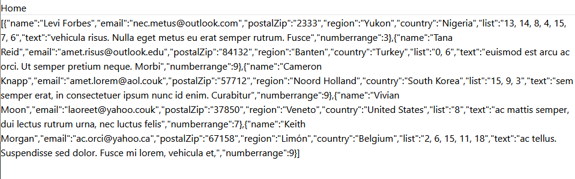

# Pagination in Static Site Development - Eleventy & TailwindCSS
George D. Crochiere

COMM-429 Front End Development

## Table of Contents
- [What is Pagination?](#intro)
- [Pagination and Eleventy - The Basics](#pag-elev)
- [How to Implement Pagination in Eleventy](#implement)
    - [Prerequisites](#prereq)
    - [Creating the Pagination](#start)
    - [Modifying the Amount of Data Shown](#modify)
    - [Additional Features of Pagination](#additional)
- [Usefulness and Importance](#use-import)
- [Conclusion](#conclude)

___

<a name="intro"></a>

## What is Pagination?
**Have you ever wanted to take a large dataset that you needed for your website, and have your pages be automatically be built and populated with the data so that you don't have to copy-paste all the formatting, just to go back in and change every detail?**

In classic web development, when developing a full website, each HTML page needs to be made by hand, whether it be for a single instance of any particular page style, or the constant development of the same type of page, with slightly different data displayed and a different URL on for the page. This would usually result in a long repetitive process to build a large-scale website.

Then there is developing a website with a fully dynamic method, and while this make it easier to control how each page is made, this typically does not result in a static site. Dynamically developed websites, such as sites built off of [React.JS](https://react.dev/), [ASP.NET](https://dotnet.microsoft.com/en-us/apps/aspnet), etc., utilize a form of server and database to comprise all the necessary. This allows for live, private, data to always be in use without an API.

To develop a static site that can be hosted on most platforms, while not needing to make every single page, a static site generator, such as [Eleventy](https://www.11ty.dev/), can be utilized. The final product is a completly static webpage, while being able to use pre-generated data to fill the pages, and API calls to get avaliable data.

**But if there are several pages, with a similar layout and different part of data, how can we make these pages easier?**

This is where pagination comes into play. Pagination is the ability to develop a style of webpage, using it as a template, develop as many pages are needed to convert a data set into a series of navigatable pages. These pages can have any specific number of entries, but all entries are a part of the same dataset.

>This article will cover pagination in Eleventy, the options behind it, how to implement pagination into an Eleventy site, and options on how it can expand.

___
<a name="pag-elev"></a>

## Pagination and Eleventy - The Basics
In Eleventy, pagination allows one take a set or collection of data, and turn it into iterable web pages that displays content in a pre-set format. The data that Eleventy uses to generate the pages built for pagination has to be obtained prior to the site's final deployment. Some examples of datasets, with links on more information on how to utilize it, that can be used are:

- [Static JSON Data](https://www.tutorialspoint.com/json/json_quick_guide.htm)
- [JSON Data written in JavaScript](https://www.w3schools.com/js/js_object_definition.asp)
- Data pre-generated from requests and responses
    - [Eleventy-Fetch](https://www.11ty.dev/docs/plugins/fetch/)
    - [JavaScript Fetch](https://developer.mozilla.org/en-US/docs/Web/API/Fetch_API/Using_Fetch)
- [An Eleventy Collection](https://www.11ty.dev/docs/collections/)
    - Folder of Markdown Files
    - [Files specified into a group via Nunjucks Tags](https://tannerdolby.com/writing/create-a-custom-collection-with-eleventy/)
    - [A specially generated and filtered Eleventy Collection](https://www.mattmcadams.com/posts/2022/working-with-11ty-collections/)

With pagination, before we start developing, it is good to have the dataset that we want to paginate on figured out, along with knowing how many of the data elements will be on each visible page. Lastly, it is good to know if there is a specific format of naming convension you want to utilize. **Can all this be changed later, yes.** However, there is a chance that you'll need to completely remove the generated site as you develop if most of this changes, as it can result in extra pages being open in the final product.

___
<a name="implement"></a>

## How to Implement Pagination in Eleventy

<a name="prereq"></a>

### Prerequisites
While this tutorial will not be going over how to fully implement a full project utilizing Eleventy, some structure needs to be established ahead of time. This project assumes that you have the following:

- A ```src``` folder that contains the data, pages, and components of the Eleventy site
    - Some form of data source that you wish to iterate over ([See above for more details](#pag-elev))
        - Ex. A ```_data``` folder with at least one of the following:
            - Static JSON data
            - JSON data formatted in JavaScript
            - JavaScript files fetching and returning data elements
        - A folder containing the files you wish to iterate over
            - Ex. A ```blog``` folder containin Markdown Files
        - A specific collection made in the ```.eleventy.js``` file at the root of the project
    - A place to store layouts in your project
- A folder that outputs your final site (in case you want to change up your pagination)

A template Eleventy project can be found on [GitHub](https://github.com/GeorgeCrochiere/comm429-eleventy-pagination-template), which utilizies [Eleventy](https://www.11ty.dev/), [TailwindCSS](https://tailwindcss.com/), and [DaisyUI](https://daisyui.com/), though only Eleventy is needed for pagination. Note that [Node.JS](https://nodejs.org/en) is required and therefore must be installed. **This project is what will be utilized to demo pagination in this post.**

To utilize the repository, after opening the project, enter the following commands in your terminal to install the required node packages:

```bash
npm install
npm install -D
```

This project will have the following initial directory, where any file reference that has a name of **"Blank"** or **"blank"** is simply en empty file to save the directory location on GitHub. This project will utilize JSON data as the data source:

```
:.
│   .eleventy.js
│   .gitattributes
│   .gitignore
│   package-lock.json
│   package.json
│   tailwind.config.js
│   
├───node_modules
├───src
│   │   index.njk
│   │   
│   ├───_data
│   │       paginationData.json
│   │       
│   └───_includes
│       │   basehead.html
│       │   
│       ├───assets
│       │       blank.txt
│       ├───components
│       │       Blank.js
│       │       
│       ├───css
│       │       global.css
│       │       
│       ├───js
│       │       blank.js
│       │       
│       └───layouts
│               base.njk
│               home.njk
│               
└───_gen
        style_init.css
```

This project can be launched with the terminal command:

```bash
npm start
```

If you want to learn more about creating your own Eleventy Static site, any of the following resources an be used:

- [freeCodeCamp - Learn Eleventy](https://www.freecodecamp.org/news/learn-eleventy/)
- [Eleventy Documentation - Getting Started](https://www.11ty.dev/docs/)
- [Eleventy Documentation - Tutorials](https://www.11ty.dev/docs/tutorials/)

The different programming languages that you should at least be familiar with include:

- HTML
- JSON
- Nunjucks

___

<a name="start"></a>

### Creating the Pagination
When getting started with pagination, we need to know what our dataset that we are working with contains. Pagination works by seperating a dataset by groupings of it's components of data, sorted by objects, akin to grouping a spreadsheet by every so-many rows. This involves looking at the data.

To look at the data, we can either look at the data files, such as this project's JSON data, by viewing the data generated from a request by viewing the URL in a browser, or by dumping the data into Eleventy. In this case, the the raw JSON data is provided in the file ```src/_data/paginationData.json``` (randomly generated with [generatedata.com](https://generatedata.com/)), and the data is dumped in ```src/index.njx```, both of which are shown below.

.](../../src/assets/img/paginationDataJSON.png)

<p class="imgQuote">Data from the paginationData.json file, generated with <a href="https://generatedata.com/">generatedata.com</a>.<p/>



<p class="imgQuote">The data dump from the previously mentioned generated data.</p>

We are now going to create the layout of the pagination page. Let's assume you have a layout template that you want your paginated page to be based off it. In this case, we'll be using ```home.njk```. Let's create a ```contact_page.njk``` file directly in the ```src``` directory.


<p class="imgQuote">Adding the contact page file.</p>

Next, we're going to put the following Nunjucks data at the top of the new pagination file. This information relates to the base layout that the page will utilize, the general title and description information, and more information related to pagination.

```njk
---
layout: layouts/home.njk
title: Test Pagination Data
description: Individual Contact Page
pagination:
    data: paginationData
    size: 1
    alias: contact
---
```

**Let's break it down:**

- ```layout```: The file that will become the base layout for each paginated page.
- ```title```: The title of each paginated page. This cannot refer to paginated data easily. Shows in the tab name at the tab on the browser.
- ```description```: The details that show on the webpage. Helps in Browser SEO.
- ```pagination```: A header category relating to the start of Pagination data.
    - ```data```: The collection or dataset that we want to paginate over, in this case the name of the file that contains our data, ```paginationData.json``` without a file extension.
    - ```size```: The number of paginated elements that you want to have on each page. This can be useful for having individual pages deticated to specific information, or a repeating process of information for multiple users on one page.
    - ```alias```: The variable name you'll refer to each object in the series of data by.

At this rate, we have iterated through each object and created a page that relies on it's data. We can see that every object is loaded into it's respective page, and matches to the JSON data, by adding the following code below the previous code block in the ```contact_page.njk``` file:

```njk
<h1>{/{title}}</h1>
<h1>{/{description}}</h1>
<hr/>

<p>{/{contact.name}}</p>
<p>{/{contact.email}}</p>
<p>{/{contact.postalZip}}</p>
<p>{/{contact.region}}</p>
<p>{/{contact.country}}</p>
<p>{/{contact.list}}</p>
<p>{/{contact.text}}</p>
<p>{/{contact.numbverrange}}</p>
<hr/>
```

___

<a name="modify"></a>

### Modifying the Amount of Data Shown

There are a couple of components, most similar to Eleventy, that are essential to being able to grab this data.

1. To access the components of the data within the object, we utilize curly braces to tell the Nunjucks document to get data, rather than use straight plaintext.
2. To access the data itself, we refer to the specific object with the alias, rather than with the data collection and an index.
3. The specific components that are accessed with the dot ```.``` operator match up exactly with the name of each parameter in the object.

This currently produces the following output with the URL [http://localhost:8081/contact_page/](http://localhost:8081/contact_page/):


<p class="imgQuote">Results of the contact_page URL.</p>

Note how this differs when we go to the URL [http://localhost:8081/contact_page/1](http://localhost:8081/contact_page/1):


<p class="imgQuote">Results of the contact_page URL, second page.</p>

We can moodify the values within the pagination model to alter how a single page is loaded. For example, say we modify ```size``` to have a different value, suce as ```2```. This produces the following result on the URL [http://localhost:8081/contact_page/](http://localhost:8081/contact_page/):


<p class="imgQuote">Results of the contact_page URL after changing the size.</p>

Note how this removes all results. We can get the results back by indexing on the list of objects that is now ```contact```. Modify the file to read as follows:

```njk
---
layout: layouts/home.njk
title: Test Pagination Data
description: Individual Contact Page
pagination:
    data: paginationData
    size: 2
    alias: contact
---

<h1>{/{title}}</h1>
<h1>{/{description}}</h1>
<hr/>

<p>{/{contact[0].name}}</p>

<p>{/{contact[1].name}}</p>
```

We now get results to show on the loaded page:


<p class="imgQuote">Results of the contact_page URL after increasing size and fixing data indexing.</p>

___

<a name="additional"></a>

### Additional Features of Pagination
Great! We now have a way to show lots of data in an organized, consistent manner. There are some other features that should be noted about pagination and Eleventy.

In the Nunjucks set-up for the page, we can add the following element in association with pagination to make links more customizable, and to not rely on the 0-th indexing utilizing the same page as a potentially preexisting webpage.

```njk
permalink: "url/specification/with/nunjucks"
```

In turn with our example, say we wanted to utilize a person's name as the URL ending, we can change the heading to be (note that ```slugify``` makes the text easier for URLs):

```njk
---
layout: layouts/home.njk
title: Test Pagination Data
description: Individual Contact Page
pagination:
    data: paginationData
    size: 1
    alias: contact
permalink: contact/{/{contact.name | slugify}}
---
```

Now to get to our first page, we would have to enter the URL [http://localhost:8081/contact/levi-forbes](http://localhost:8081/contact/levi-forbes), which matches directly with the name of the first contact, "Levi Forbes," according to the JSON data file. Though it should be noted that if the size is also altered, the ```contact``` would have to be indexed.

>It should also be noted that based on the format of the data and what is provided, you could allow for better navigation between specialized pages. There is so much that can be done with Pagination and Eleventy, it's based on how you build it.

>Additional information regarding Pagination in Eleventy and what it can do can be found at [this link](https://www.11ty.dev/docs/pagination/).

___

<a name="use-import"></a>

## Usefulness and Importance

While it was mentioned that pagination is used organized data into seperate or grouped pages to allow for better data management, [as previously mentioned at the beginning of this post](#intro), it becomes significant in ensuring for better data control on repetitive pages while tieing it in with response and loading time of webpages. The seperation of data between different pages allows for easier navigation of larger sites, visibility control of datasets and queries, and overall decreased data transfered between a client and a server at any particular instance.

When a web page has a significant amount of data, more information needs to be transfered between the client and server to properly display the webpage. This ties in very well with additional fetch requests and the loading of API data associated with data that may be stored.

An example of this would be the listing of all data associated with a general topic, to be made into paginated data, such as a list of exercises that can be done during a workout. Each page can then use a keyword tied in with the API fetch needed to gather the rest of the information, such as image calls and other details that would not be stored in the same location as the general list of information. If all data needed to load a page was based in the main database, it would significantly increase the cost of hosting, and increase the amount of data served to the user.

___

<a name="conclude"></a>

## Conclusion
Pagination has the ability to make a site more manageable, easier to use, and easier to sort through if data is compiled and translated into a series of associated pages. Hopefully with additional knowledge of how pagination works, more pages can make use of it in association with static data to make better sites.

Happy Coding!

___