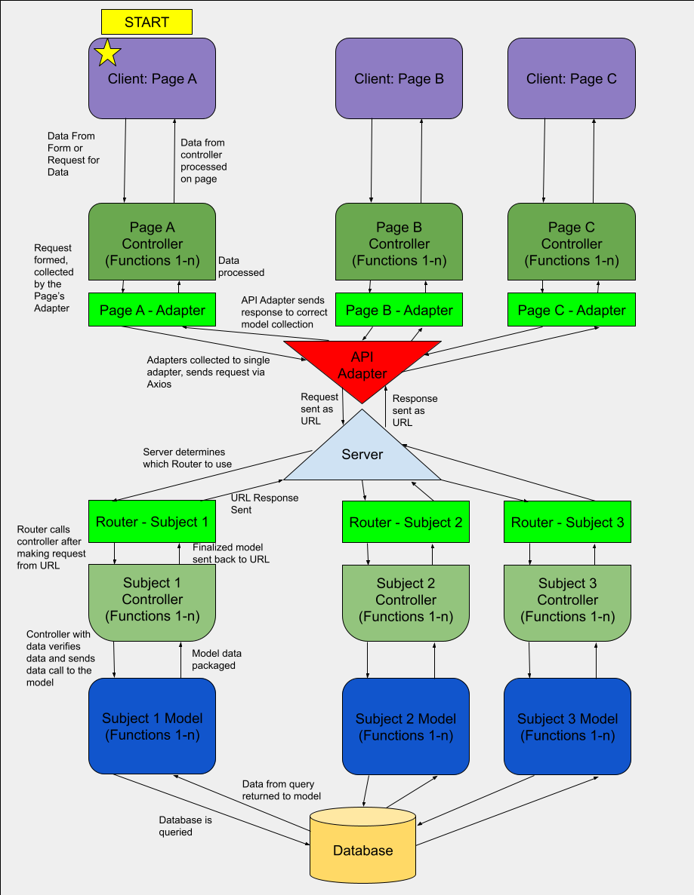

<link rel="stylesheet" href="https://cdnjs.cloudflare.com/ajax/libs/highlight.js/11.9.0/styles/base16/dracula.min.css">

<script src="https://cdnjs.cloudflare.com/ajax/libs/highlight.js/11.9.0/highlight.min.js"></script>
<script src="https://cdnjs.cloudflare.com/ajax/libs/highlight.js/11.9.0/languages/javascript.min.js"></script>

# Fullstack Development - Client and Server Communication with Abstraction
George D. Crochiere

COMM-429 Front End Development

## Table of Contents
- [Introduction](#intro)
- [The Example & Stack](#example)
    - [Prerequisites](#example-prereq)
- [Communication Structure](#structure)
    - [Client](#structure-client)
    - [Server](#structure-server)
    - [Diagram](#structure-diagram)
- [Implementation Overview](#implement)
- [Conclusion](#conclude)

___

<a name="intro"></a>

## Introduction
In the development of a larger web project, there is typically the need to update and recieve data between the website, and a database of some form. While it is possible to get data utilizing the [fetch](https://developer.mozilla.org/en-US/docs/Web/API/Fetch_API/Using_Fetch) command with JavaScript and data APIs, the only way to alter data and store it permanently is with a database.

With this is mind, in the development of a project I am working on at my university, the developement of the Honors Program website, I've needed to implement more methods to the program to access data from the associated database, needing to build off the pre-existing system. Given how the system has been abstracted to allow for more organized data structures, this article was designed to give an overview on how you can possible structure your client-server communication.

___

<a name="example"></a>

## The Example & Stack
To recap, this project is a closed-source project that already exists, focused on tracking submitted data for my university's honors program, which include program requirements such as service hours. This project was made with the following stack:

- [NodeJS](https://nodejs.org/en)
- [ReactJS](https://react.dev/)
    - HTML
    - CSS
    - JavaScript
        - [Material MUI](https://mui.com/material-ui/)
- [ExpressJS](https://expressjs.com/)
    - JavaScript
- [Axios](https://axios-http.com/docs/intro)
- [MySQL](https://www.mysql.com/)

The project itself is primarly broken into three directoried:

- ```client``` - Contains files relavent to maintaining the client side of the website
- ```server``` - Contains files associated with the server and interactions with the MySQL database
- ```shared``` - A directory associated with schematic files utilized by both the client and the server.

___

<a name="prereq"></a>

### Prerequisites
Note that for this project to work, you need to have a client-server based website that is based off of ReactJS and ExpressJS. **This article will not cover how to start a project from scratch; it will assume you have some client and server at least functional.**

For some examples on how to start a project between a ReactJS client and an ExpressJS server, you can refer to [this DEV Community article](https://dev.to/techcheck/creating-a-react-node-and-express-app-1ieg) or  [this freeCodeCamp article](https://www.freecodecamp.org/news/create-a-react-frontend-a-node-express-backend-and-connect-them-together-c5798926047c/) for some examples.

To make it easier, you should also have some background with how general requests and responces work, as mentioned in the following secion on the structure of the program. This will make it easier to troubleshoot, as this post will not include all code to make the program run, just the code associated with requests and responces.

___

<a name="structure"></a>

## Communication Structure
When you are making your first ReactJS and ExpressJS project, you might have an example of creating requests and responses between the client and server. The freeCodeCamp tutorial above gives us a server that has a main router broken into the main server file and the router controller, and the client page file that utilizes fetch to get data.

##### server-app.js - freeCodeCamp.org
```javascript
var testAPIRouter = require("./routes/testAPI");
...
app.use("/testAPI", testAPIRouter);
...
```

##### server-test-router.js - freeCodeCamp.org
```javascript 
var express = require(“express”);
var router = express.Router();

router.get(“/”, function(req, res, next) {
    res.send(“API is working properly”);
});

module.exports = router;
```

##### client-app.js - freeCodeCamp.org
```javascript 
...
constructor(props) {
    super(props);
    this.state = { apiResponse: "" };
}

callAPI() {
    fetch("http://localhost:9000/testAPI")
        .then(res => res.text())
        .then(res => this.setState({ apiResponse: res }));
}

componentWillMount() {
    this.callAPI();
}
...
<p className="App-intro">;{this.state.apiResponse}</p>
...
```

While this server setup is a starting point, we need to expand upon both setups to allow for more abstraction and better control of each operation.

>For more information on how requests (GET and POST) and responses work in web communication, you can refer to [this article from the MDN Web Docs](https://developer.mozilla.org/en-US/docs/Web/HTTP/Messages)

___

<a name="structure-client"></a>

### Client
The client is the part of the whole projects that sets up the request in the first place, regardless of the type that is initialized. To allow for the website client to be able to control how its calls are made, a file can be made for each webpage that contains the different API functions. This is known as a controller. The controller doesn't push the entire function; it only takes the inputs that are passed into it from the webpage, and moves into the generalized website ```apiAdapter```, which when given the list of files it can pull functions from, then sends the request message to the server.

<a name="structure-server"></a>

### Server
When a request is picked up by the server, the ExpressJS server gets the URL that is the request, as all requests and the data associated with them are identified by a unique URL, and uses the first argument to identify which router to utilize. This file also takes the input arguments and starts passing the data through the system into the next stages of the server. The router then identifies which code to run, with this code being the model that represents the data. It is in this model file that the data is actually processed and it interacts with the database.

In general, as each of these functions are making a request to a function, followed by a form of response, this responce is then constantly passed back up through the chain, and forms a responce that is sent via a URL. This URL responce goes back to the client, where this process continues to return data to be added to the server.

<a name="structure-diagram"></a>

### Diagram
Below is a diagram that outlines the above process in a visual form:



<p class="imgQuote">Diagram of Client and Server interactions.</p>

The communication that occurs between the client and the server, at least in the form of this project, relies on a singular instance of the Axios API Adapter, though this can be replaced with the use of the [fetch API](https://developer.mozilla.org/en-US/docs/Web/API/Fetch_API/Using_Fetch).

___

<a name="implement"></a>

## Implementation Overview

>**THIS CODE IS NOT ACCURATE TO EVERY PROJECT!** Given how this project is closed source, the code provided on this blog post has been altered. You will likely have to modify some code to work best with your database, the data you are passing from the client to the server, and more.

To implement this entire process, we can start on the server-end, where similar to the freeCodeCamp.org example. 

>**NOTE:** This project does not show the exact folder pathing used in this project. Whatever file system you implement only modifies import-related statements.

Let's start with the server. We're going to assume that the database is fully set up as well, as this setup is very much determined by what your website is for. The model is the section of code that, given input data from a request, actually runs the process in the database to obtain or modify the data stored.

>This model system utilizes a specific database helper and models to get information relating to the database. This is a connection that creates a single instance of the database utilizing the following node packages: ```mysql2```, ```express-session```, and ```express-mysql-session```. The database is initialized to ensure that a single connection exists at one time to reduce resources used on the server.  Database initialization is done on server startup, and each request simply uses the call.

##### database_helper.js
```js
...

const initializeDatabase = (config, callback) => {
  if (_connection) {
    throw new Error('database is already initialized');
  }

  // initialize mysql connection
  _connection = mysql.createPool(config);
  // initialize session store
  _sessionStore = new MySqlStoreClass({}, _connection);

  console.log(
    `database initialized -- connected to ${config.host}:${config.port}`,
  );

  return callback();
};

...

const getConnectionPool = () => {
  assert.ok(_connection, 'database has not been initialized');
  return _connection;
};
```

##### test_model_function.js - Located in the directory 'src/models/testing'
```js
const databaseHelper = require('database_helper');
const {
    PayloadModel,
} = require('payload_model');
...
const someDatabaseModelFunction = async (data) => {
    // Some processing here
    const query = 'SELECT * FROM ... WHERE a = ? ...' // Enter your query
    const params = [aParam];

    const [data] = await databaseHelper.getConnectionPool().query(query, params);
    return new PayloadModel(data); // PayloadModel is defined as a object able to hold data,
                                    // stored in the variable "data".
}

module.exports = someDatabaseModelFunction;
```

Once we have out model's function, we can now make this model accessible to the server's controller via a process of pathing the exports into a singular index.js file. For this example, we'll path this into a testing model group, with these model groups being pathed into an overall model pattern. This nesting process allows us to categorize model functions based on their overall functionality, and to further make them all accessible from a single import.

##### index.js - Located in the directory 'src/models/testing'
```js
const someDatabaseModelFunction = require('./test_model_function.js');

module.exports = {
    someDatabaseModelFunction,
}
```

##### index.js - Located in the directory 'src/models'
```js
const testingModel = require('./testing');

module.exports = {
    testingModel,
}
```

This makes the ```someDatabaseModelFunction``` database accessor avaliable in the overall models import statement, but we need to now incorporate the controller for the server. This controller will need to call the model that was just made, but is the functionality that is called when the request is taken.

___

With this all in mind, let's start by creating the specific controller for the previously created model.

##### someDatabaseModelFunction.controller.js - Located in the directory 'src/testing/controller'
```js
const { testingModel } = require('../../models');
...
const someDatabaseModelFunction = async (request) => {
    // Pull data from the request if needed, for example, session data from the header.
    const data = // Some input data, from above statement
    const model = await testingModel.someDatabaseModelFunction(data);

    const responce = {
        data: model.data,
        header: {
            // Add other header data, such as success variable, etc.
            status: 0 // Success
        },
    };
    return response;
};

module.exports = someDatabaseModelFunction;
```

We can now import this specific controller in the "testing" router into it's index file. This needs to be done by first getting all controllers into a single file for a list of all possible controllers, which can then be implemented into the router.

##### index.js - Located in the directory 'src/testing/controller' - Concatenates controllers
```js
const someDatabaseModelFunction = require('./someDatabaseModelFunction.controller');

module.exports = {
    someDatabaseModelFunction,
}
```

##### index.js - The router for all 'testing' API server calls, located in the directory 'src/testing'
```js
const express = require('express');
const controller = require('./controller');
const router = express.Router();

// Now create the associated get/posts requests. 
// For the purposes of this, our function will be a post request.
// The data will be accessed at the URL (with port 3001):
// localhost:3001/testing/testingPost
router.post('/testingPost', async (req, res) => {
    const request = {
        header: // Create request data with data from req
                // this 'req' variable is what is sent over the internet.
    }
    const response = await controller.someDatabaseModelFunction(request);
    return res.send(response);
});

module.exports = router;
```

Finally, we can add our router to the ```app.js``` file that contains all the overall router connections.

##### app.js - The main function for the server, located in the directory 'src'
```js
... // NOTE: you'll likely need more import statements, with this example showing the routing of models
const express = require('express'); 
const sessions = require('express-session');
const bodyParser = require('body-parser');
const testingRouter = require('./testing');
...
const server = express();
...
server.use(bodyParser.urlencoded({ extended: true }));
server.use(bodyParser.json());
...
    // After Database initialization, in follow-up function
    server.use('/testing', testingRouter);
...
```

Assuming that all other, relavant, import statements are included, the ExpressJS server should now work, congrats! However, this leads us with the next major step of the project; the client...

___

For the client, we're going to assume that you've created a project that incorporates a folder for the page you want to include the database query for. In this example, we'll use the page titled "Test Page", which will be located in the folder 'src/test_page' in the client.

>To get us started, as a reminder, this verion of the project will be utilizing Axios, a NodeJS package designed to help with requests and responces between a client and a server, except it's a bit easier to add in parameters for the request. This will be referenced as the project continues.

For this project, the Axios instance is located in the directory 'src/apiAdapter' within the client. This directory consists of a main ```index.js``` file, an ```axios_instance.js``` file, along with an adapter file for each specific page. These adapter files for the client are similar to the controller file on the server, where only one can exist for a page or set of pages, with the controller contributing to several requests; the main difference between each controller is the start of the request URL.

##### axios_instance.js - Located on the client at 'src/apiAdapter'
```js
import axios from 'axios';

const instance = axios.create({
  baseURL: 'http://localhost:3001',
  withCredentials: true, // Optional setting, based on how secure you want your request system. 
                        // Possible to effect the server files.
});

export default instance;
```

##### testing.adapter.js - Located on the client at 'src/apiAdapter'
```js
import axiosInstance from 'api_adapter/axios_instance';

export const someDatabaseModelFunction = async (request) => {
    // Can add other functions to clean up between request input and response.
    // Use the URL of the GET/POST request you are using on the server
    const responce = await axiosInstance.post('/testing/testingPost', {request});
    return response;
}
```

##### index.js - Located on the client at 'src/apiAdapter'
```js
import * as testingAdapter from 'apiAdapter/testing.adapter';

const apiAdapter = {
    ...testingAdapter,
};

export default apiAdapter;
```

These componets of code will at least get our ```apiAdapter``` functional to use on the client. We can now create the controller for the site. We're going to create the following file in the 'src/test_page/controller' directory.

>**NOTE:** This single controller file can contain several apiAdapter functions as well.

##### test_page.controller.js - Located on the client at 'src/test_page/controller'
```js
import apiAdapter from "apiAdapter";
...
const someDatabaseModelFunction = async (dataValue1, dataValue2, dataValue3) => {
    const response = await apiAdapter.someDatabaseModelFunction({
        // You can format your data however you best see fit
        data: {
            val1: dataValue1,
            val2: dataValue2,
            val3: dataValue3,
        },
    });
    return response;
}

...

const testPageController = {
    someDatabaseModelFunction,
    ...
};

export default testPageController;
```

We've just created our controller that we can now use to get data from the database into the server from the client! Now, let's go on the page itself, and do it!

##### index.jsx - Example page, located in client at 'src/test_page'
```js
import React, {
    ReactElement,
    useEffect,
    useState,
    useRef,
} from 'react';
...
import {testPageController} from './controller';
...

export default function TestPage() {
    ...
    // You can utilize the call in most places on the page, based on the prereqs.
    const getData = async(v1, v2, v3) => {
        const request = await testPageController.someDatabaseModelFunction(v1, v2, v3);
        const dataResponse = request.data.data // Exact path will likely be different
                                                // Implementation based
        ...
        // Do something with the data
    }
    ...
}
```

>**FUNFACT:** You may have noticed that we used the same function name several times in this project, ```someDatabaseModelFunction```. This is **NOT** required. This can make it easier to ensure that in each layer the correct function is being called, but this can change to make it more unique to the overall project.

___

<a name="conclude"></a>

## Conclusion
This has been an example on how to add a level of abstraction to a client-server website for database access, but this isn't the only way to do this. Several people have worked on various methodologies to add a form of middleware ([example by Medium](https://gtsopour.medium.com/nodejs-express-middleware-abstraction-2d25926516e4)) or add other forms of abstraction. Feel free to experiement with ReactJS and ExpressJS to make the client and server that work best for your project.

The main thing to worry about after the development of your system, is to make is maintainable and teachable enough to allow for future developers and webmasters to take your place!

Happy Coding!

<script>hljs.highlightAll();</script>